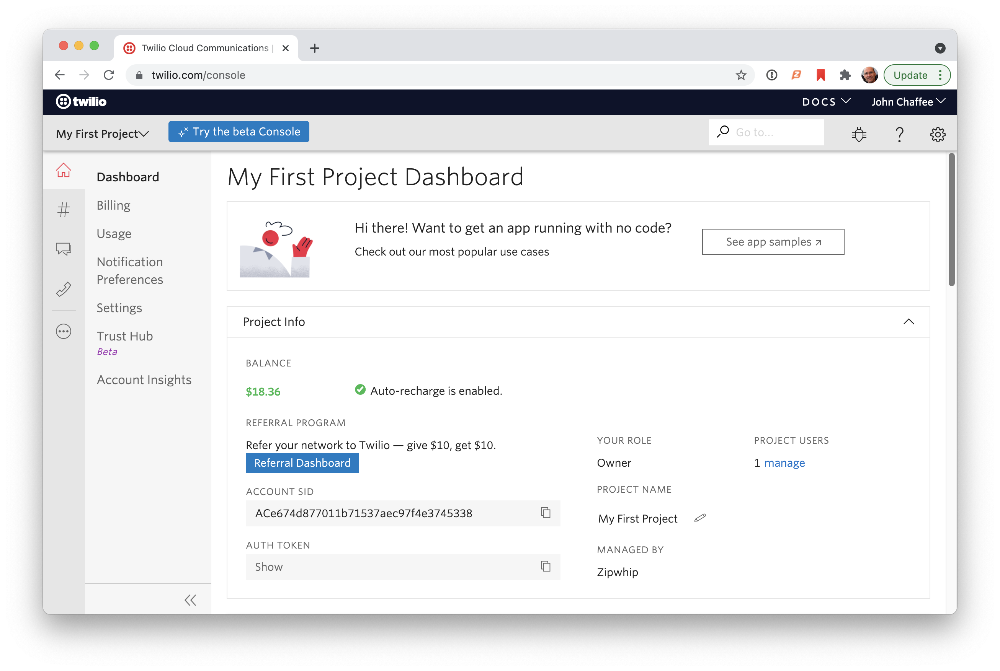
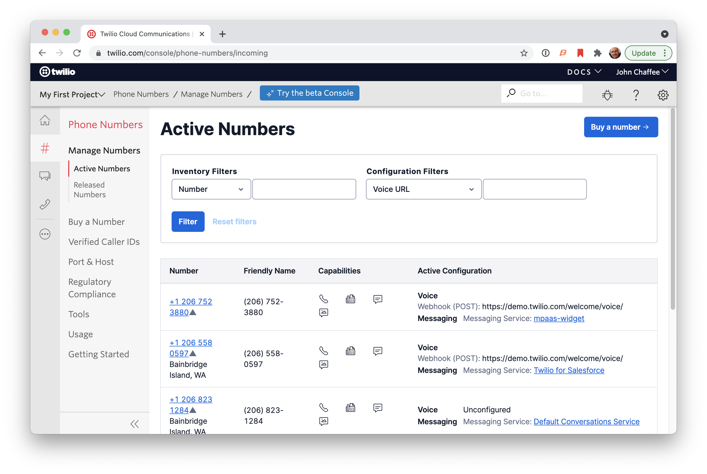

## Twilio Overview

<div class="text70">

- Account Setup
  - Account SID & Token
  - Phone Numbers
- APIs
  - Authentication
  - SDKs and CLI
  - Messaging API
  - Conversations API
  - Webhooks
- Apps
  - Twilio for Salesforce (widget)
  - Twilio Flex
  - Twilio Frontline

</div>


## Account SID & Token




## Phone Numbers




## Authentication

- [Authentication](https://www.twilio.com/docs/iam/credentials/api#authentication) is account based
  - https://www.twilio.com/docs/iam/credentials/api#authentication
  - Account SID + Auth Token
- Single token provides access too all lines associated with an account
- Unique [API Keys](https://www.twilio.com/docs/iam/keys/api-key) can be created/revoked
- Auth Token param in header of API request


## API Consumption

<div class="text90">

- All docs require use of client library
- [Twilio SDKs](https://www.twilio.com/docs/libraries)
  - node, python, ruby, java, c#, php
- [Twilio CLI](https://www.twilio.com/docs/twilio-cli/quickstart)
  - provides access to all APIs from the command line
- [Open API](https://developers.zipwhip.com/api/twilio/spec/)
  - Beta OAI spec. It's massive and not very user friendly.
- [Postman](https://www.twilio.com/docs/openapi/using-twilio-postman-collections)
  - Methods for finding/buying phone numbers, and sending/fetching messages.

</div>


## SDK Example

Node SDK - Send Message

```javascript [1-2|4-5|7-13]
const accountSid = 'ACXXXXXXXXXXXXXXXXXXXXXXXXXXXXXXXX'; 
const authToken = 'your_auth_token'; 

const twilio = require('twilio');
const client = new twilio(accountSid, authToken);

client.messages
  .create({
    body: 'Hello from Node',
    to: '+12345678901', 
    from: '+12345678901', 
  })
  .then((message) => console.log(message.sid));
```


## CLI Usage

Twilio CLI commands

<div class="text60">

```bash [1|3-12|14|16-46|48|50-75|77|79-84]
$ twilio

TOPICS
  api            advanced access to all of the Twilio APIs
  debugger       Show a list of log events generated for the account
  email          sends emails to single or multiple recipients using Twilio SendGrid
  feedback       provide feedback to the CLI team
  flex           Create, develop and deploy Flex plugins using the Twilio CLI.
  phone-numbers  manage Twilio phone numbers
  plugins        list available plugins for installation
  profiles       manage credentials for Twilio profiles
  token          Generate a temporary token for use in test applications

$ twilio api

TOPICS
  api:accounts       resources under accounts.twilio.com
  api:autopilot      resources under autopilot.twilio.com
  api:bulkexports    resources under bulkexports.twilio.com
  api:chat           resources under chat.twilio.com
  api:conversations  resources under conversations.twilio.com
  api:core           resources under api.twilio.com
  api:events         resources under events.twilio.com
  api:fax            resources under fax.twilio.com
  api:flex           resources under flex-api.twilio.com
  api:frontline      resources under frontline-api.twilio.com
  api:insights       resources under insights.twilio.com
  api:ip             resources under ip-messaging.twilio.com
  api:lookups        resources under lookups.twilio.com
  api:messaging      resources under messaging.twilio.com
  api:monitor        resources under monitor.twilio.com
  api:notify         resources under notify.twilio.com
  api:numbers        resources under numbers.twilio.com
  api:pricing        resources under pricing.twilio.com
  api:proxy          resources under proxy.twilio.com
  api:serverless     resources under serverless.twilio.com
  api:studio         resources under studio.twilio.com
  api:supersim       resources under supersim.twilio.com
  api:sync           resources under sync.twilio.com
  api:taskrouter     resources under taskrouter.twilio.com
  api:trunking       resources under trunking.twilio.com
  api:trusthub       resources under trusthub.twilio.com
  api:verify         resources under verify.twilio.com
  api:video          resources under video.twilio.com
  api:voice          resources under voice.twilio.com
  api:wireless       resources under wireless.twilio.com

$ twilio api:core

TOPICS
  api:core:accounts                 Twilio accounts (aka Project) or subaccounts
  api:core:addresses                An Address instance resource represents your or your customers physical location within a country. Around the world, some local authorities
                                    require the name and address of the user to be on file with Twilio to purchase and own a phone number.
  api:core:applications             An Application instance resource represents an application that you have created with Twilio. An application inside of Twilio is just a set of
                                    URLs and other configuration data that tells Twilio how to behave when one of your Twilio numbers receives a call or SMS message.
  api:core:authorized-connect-apps  Authorized Twilio Connect apps
  api:core:available-phone-numbers  Country codes with available phone numbers
  api:core:balance                  Account balance
  api:core:calls                    A Call is an object that represents a connection between a telephone and Twilio.
  api:core:conferences              Voice call conferences
  api:core:connect-apps             Twilio Connect apps
  api:core:incoming-phone-numbers   Incoming phone numbers on a Twilio account/project
  api:core:keys                     API keys
  api:core:messages                 A Message resource represents an inbound or outbound message.
  api:core:notifications            [DEPRECATED] Log entries
  api:core:outgoing-caller-ids      An OutgoingCallerId resource represents a single verified number that may be used as a caller ID when making outgoing calls via the REST API
                                    and within the TwiML <Dial> verb.
  api:core:queues                   Queues of calls
  api:core:recordings               Recordings of phone calls
  api:core:signing-keys             Create a new signing key
  api:core:sip                      Create a Credential List
  api:core:sms                      Retrieve a list of short-codes belonging to the account used to make the request
  api:core:tokens                   Credentials for ICE servers
  api:core:transcriptions           Text transcriptions of call recordings
  api:core:usage                    Retrieve a list of usage-records belonging to the account used to make the request

$ twilio api:core:messages

COMMANDS
  api:core:messages:create  Send a message from the account used to make the request
  api:core:messages:fetch   Fetch a message belonging to the account used to make the request
  api:core:messages:list    Retrieve a list of messages belonging to the account used to make the request
  api:core:messages:remove  Deletes a message record from your account
  api:core:messages:update  To redact a message-body from a post-flight message record, post to the message instance resource with an empty body

```

</div>


## CLI - Send Message

messages:create

```bash
twilio api:core:messages:create \
 --from '+12067523880' \
 --to '+12063996576' \
 --body 'Hello from Twilio API'
```


## CLI - Fetch Messages

twilio api:core:messages:list

<div class="text50">

```json
$ twilio api:core:messages:list -o json
[
  {
    "accountSid": "AC76ecc1e7f1996f247f4b92e2c46ad651",
    "apiVersion": "2010-04-01",
    "body": "Test",
    "dateCreated": "2021-08-03T22:41:04.000Z",
    "dateSent": "2021-08-03T22:41:06.000Z",
    "dateUpdated": "2021-08-03T22:41:06.000Z",
    "direction": "inbound",
    "errorCode": null,
    "errorMessage": null,
    "from": "+12063996576",
    "messagingServiceSid": null,
    "numMedia": "0",
    "numSegments": "1",
    "price": "-0.00750",
    "priceUnit": "USD",
    "sid": "SMbebf2069e417c9fd5cd2957b7288819b",
    "status": "received",
    "subresourceUris": {
      "media": "/2010-04-01/Accounts/AC76ecc1e7f1996f247f4b92e2c46ad651/Messages/SMbebf2069e417c9fd5cd2957b7288819b/Media.json",
      "feedback": "/2010-04-01/Accounts/AC76ecc1e7f1996f247f4b92e2c46ad651/Messages/SMbebf2069e417c9fd5cd2957b7288819b/Feedback.json"
    },
    "to": "+12163507532",
    "uri": "/2010-04-01/Accounts/AC76ecc1e7f1996f247f4b92e2c46ad651/Messages/SMbebf2069e417c9fd5cd2957b7288819b.json"
  }
]
```
</div>


## Messaging API

- one
- two
- three


## Conversations API

- one
- two
- three

